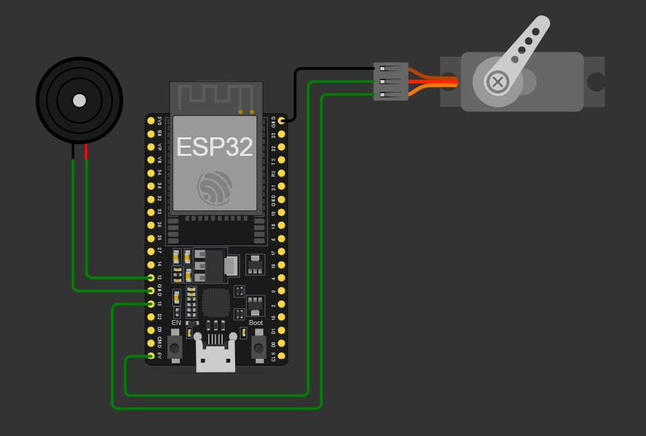
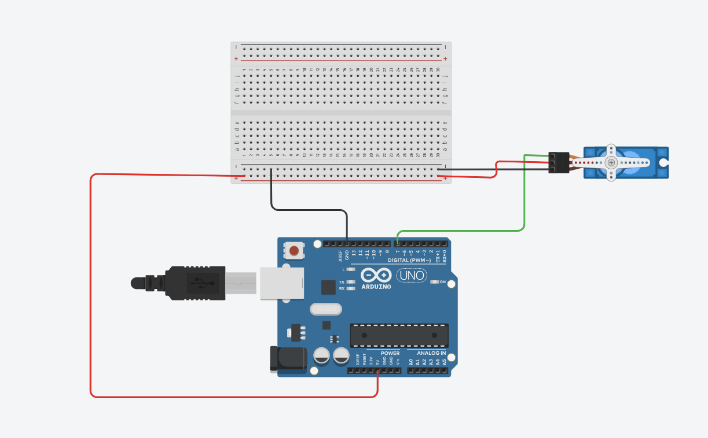

# 🐠 Smart Fish Feeder System - AI + IoT Based Automation

An ongoing project that automates fish feeding using **computer vision (OpenCV + YOLO)** and **microcontroller-based control (Arduino)**.  
The goal is to detect the number of fish in an aquarium using a **custom-trained fish detection model (from Roboflow)** and rotate a **servo motor** that many times to dispense food - ensuring accurate, efficient, and adaptive feeding.

---

## 🚀 Project Overview

Traditional automatic fish feeders release food at fixed intervals, which often leads to **overfeeding** or **food waste**.  
This project brings intelligence to the process by combining **AI-based object detection** with **hardware actuation**.

- Detects fish in real-time using a **YOLOv8 model** integrated with **OpenCV**.  
- Sends the detected **fish count** to **Arduino** through **serial communication**.  
- Arduino rotates the **servo motor** that many times to dispense food precisely.  
- Designed to later integrate with **ESP32** for **Wi-Fi and Blynk-based remote control**.  

---

## 🧠 Working Principle

1. The **webcam** captures a real-time frame of the aquarium.  
2. The **YOLO model** detects and counts the number of fish.  
3. The fish count is sent to the **Arduino** via serial communication.  
4. The **servo motor** rotates exactly that many times to release food portions.  
5. The system repeats this process **automatically every 2 hours**.  

---

## 🧩 Hardware Components

| Component | Function |
|------------|-----------|
| **Arduino UNO** | Receives commands from Python and controls the servo motor. |
| **Servo Motor** | Dispenses fish food by rotating per fish detected. |
| **Jumper Wires** | Connects components for circuit communication. |
| **Webcam** | Captures live video feed for object detection. |
| **USB Cable** | Enables serial connection between Arduino and computer. |
| *(Future)* **ESP32 Module** | Will add IoT connectivity and mobile control. |

---

## 💻 Software & Libraries

- **Arduino IDE** - For writing and uploading the servo control code.  
- **Python** - For running the object detection and communication logic.  
- **OpenCV** - To handle webcam input and image frames.  
- **YOLOv8 (Ultralytics)** - For object (fish) detection.  
- **PySerial** - To send the fish count to Arduino through serial communication.  
- *(Future)* **Blynk** - For IoT-based mobile control.

---

## Circuit Design
  
  
  
